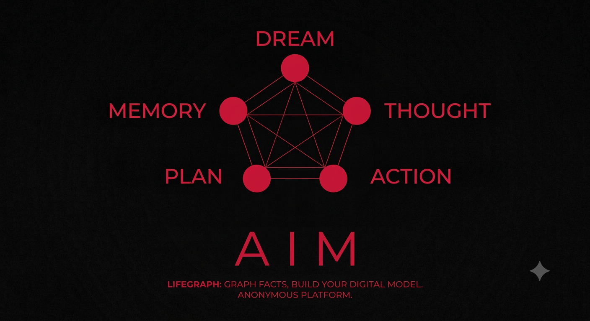
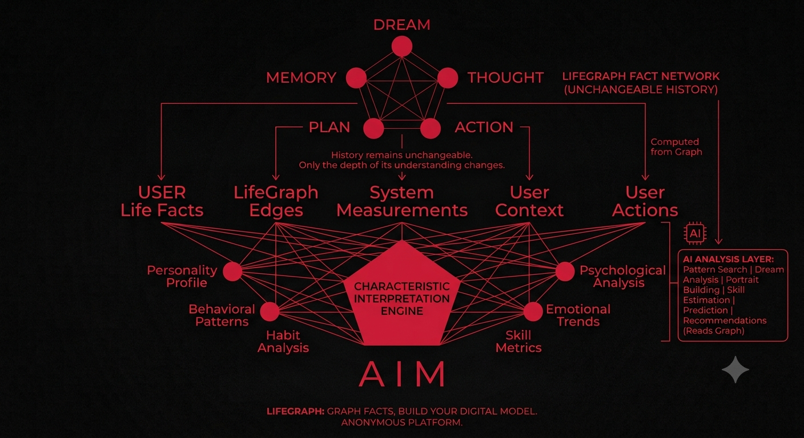

# A I M 

  

> Анонимная платформа для построения цифровой модели жизни человека через граф фактов, действий, мыслей, воспоминаний, снов и их эмоций.

### Факты неизменны. Интерпретации изменяемы.

LifeGraph хранит не выводы о человеке, а факты его жизни.

На основе этих фактов могут строиться любые модели:

- психологический профиль;
- характеристики личности;
- развитие навыков;
- привычки;
- дисциплина;
- эмоциональная динамика;
- влияние людей;
- причинно-следственные цепочки;
- AI-анализ;
- любые будущие алгоритмы.

Архитектура построена так, чтобы новые способы анализа можно было добавлять без изменения уже накопленной истории жизни.

---

## Анонимность

LifeGraph не требует раскрытия личности пользователя.

- отсутствует привязка к имени;
- отсутствует обязательный email;
- отсутствует обязательный номер телефона;
- все данные принадлежат только пользователю.

---

# Ядро системы

- **15 типов узлов** — универсальные сущности графа жизни.
- **Любые связи между любыми узлами** — без искусственных ограничений.
- **27 научно обоснованных эмоций** (UC Berkeley, 2017).
- **Измерения** любых объектов и действий (время, расстояние, вес, страницы, пульс и многое другое).
- **AI-интерпретации**, вычисляемые поверх фактов.

---

# Архитектурные принципы

## 1. Факты неизменяемы

Система хранит реальные факты жизни пользователя.

Факт не переписывается задним числом.

Если информация изменилась — создаётся новый факт или новая связь.

История всегда сохраняется.

---

## 2. Интерпретации изменяемы

Психологический профиль, дисциплина, характеристики личности, навыки, AI-анализ и любые другие выводы не являются данными.

Они вычисляются на основе графа фактов.

Алгоритмы могут совершенствоваться годами без необходимости изменять историю пользователя.

---

## 3. Граф универсален

Любая сущность может быть связана с любой другой.

Например:

- сон → человек;
- сон → воспоминание;
- действие → мысль;
- мысль → план;
- план → действие;
- действие → место;
- место → человек.

Архитектура не накладывает искусственных ограничений на структуру графа.

---

## 4. Всё является сущностью

Любой объект может стать самостоятельным узлом графа.

Например:

- сон;
- мысль;
- воспоминание;
- действие;
- человек;
- место;
- книга;
- фильм;
- статья;
- разговор;
- проект;
- музыкальное произведение.

Количество типов узлов может расширяться без изменения архитектуры базы данных.

---

## 5. Всё измеряется одинаково

Любая сущность может иметь любое количество измерений.

Например:

- эмоции;
- расстояние;
- длительность;
- вес;
- количество страниц;
- количество слов;
- температура;
- пульс;
- давление;
- настроение.

Система не содержит специализированных полей под каждую новую метрику.

Все измерения работают через единый механизм.

---

## 6. База данных гарантирует целостность

Критические инварианты реализуются внутри PostgreSQL.

Используются:

- CHECK;
- FOREIGN KEY;
- UNIQUE;
- триггеры;
- ограничения типов;
- частичные индексы.

Корректность данных не должна зависеть только от кода приложения.

---

## 7. Удаление — тоже факт

Пользовательские данные не удаляются физически.

Удаление означает только изменение состояния объекта.

Используется механизм Soft Delete (`deleted_at`).

История пользователя сохраняется полностью.

---

# Возможности

- **15 типов узлов** (Dream, Thought, Memory, Plan, Action, Person, Place, Book, Project, Conversation, Movie, Course, Website, Music, Article).
- **16 типов связей** между любыми узлами графа.
- **27 эмоций Berkeley** с интенсивностью.
- **Измерения** любых характеристик объектов.
- **Система характеристик личности**, вычисляемая на основе фактов.
- **AI-анализ** (психология, аналитика, поиск закономерностей).
- **AI-генерация изображений**.
- **Геоданные** (PostGIS).
- **Теги**.
- **Статистика и аналитика**.
- **Причинно-следственный анализ графа жизни**.

  

---

# Структура базы данных

- специализированные таблицы для атрибутов каждого типа узлов;
- граф связей между всеми сущностями;
- универсальная система измерений;
- универсальная система эмоций;
- мягкое удаление данных;
- защита AI-данных от каскадного удаления;
- расширяемая архитектура без изменения ядра.

---

# Документация

- PROJECT.md
- DATABASE_V3.md
- EMOTIONS.md
- DECISION.md
- PRIVACY.md
- NETWORK.md
- API.md

---

# Стек

- Backend — Express + TypeScript
- Database — PostgreSQL + PostGIS
- Cache — Redis
- Frontend — React + Telegram Mini App
- AI — Python Services
- Архитектура — Graph Based Architecture

---

# Лицензия

Исходный код открыт для:

- личного использования;
- обучения;
- исследований;
- некоммерческих модификаций.

**Коммерческое использование запрещено без письменного согласия автора.**

Если вы хотите использовать проект в коммерческом продукте, SaaS, корпоративной системе или получать прибыль на его основе, необходимо заключить отдельное лицензионное соглашение с автором.

---

# Контакты

Telegram: @KirillGrant

---

**Версия:** 0.4.0 Alpha

**Последнее обновление:** Июль 2026